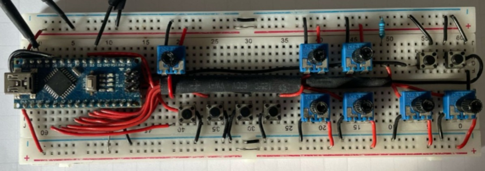
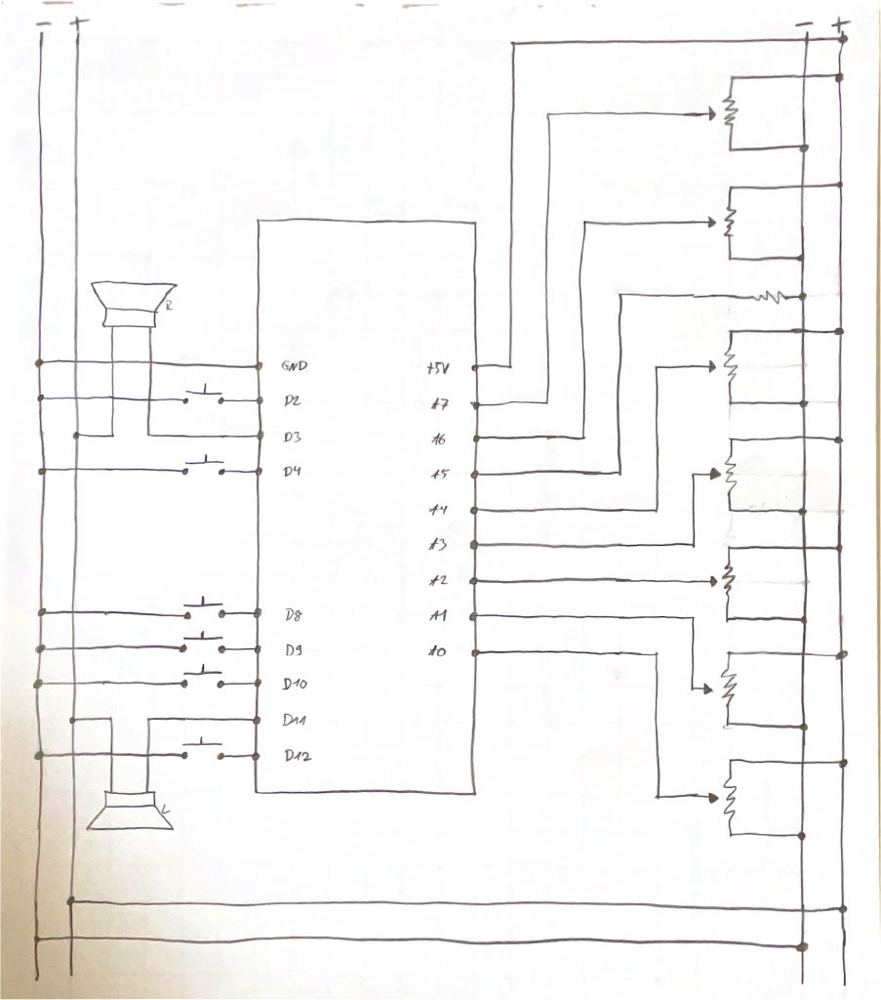

# Arduino_Nano_Synth

This project is a lo-fi stereo synthesizer based on the Arduino Nano.
It features 

- an oscillator, which can switch between a sine and
 a sawtooth wave.
- an AR envelope.
- amplitude control.
- frequency control with about an octave of range.
- pan control.
- a LFO
    - which can be a sine, square or sawtooth wave.
    - which can be set to modify the amplitude, 
    frequency or pan.
    - with variable frequency and depth.

The synthesizer has 7 variable resistors set up as voltage dividers connected to the analog input pins A0-A7 (except for A5). They are used as follows.

- A0 controls the volume.
- A1 controls the release value of the AR envelope.
- A2 controls the LFO frequency.
- A3 controls the LFO depth.
- A4 controls the pan.
- A6 controls the attack value of the AR envelope.
- A7 controls the pitch/frequency.

There are also 6 buttons connected to digital pins D2, D3, D4, D8, D9, D10 and D12. They are used as follows.

- When D4 is pressed, the sound is generated.
- D8 switches the LFO waveform.
- D9 changes the LFO destination.
- D10 fixes the frequency of the sound wave to the C-sale .
- D2 switches the waveform between a sine and sawtooth.
- D12 is currently unused.

Pins D3 and D11 are used for audio output, 
because they support PWM output, which is used to
simulate analog output.

Although this setup works with my speakers, I would 
recommend high caution for everyone trying to rebuild 
it. Since I'm not an electrical engineer, I cant 
garantee that your speakers wont be damaged.

I've also attached a rough schematic and a picture of 
my prototype. In the future i may 3D print a case,
refine the circuit and add more explanations to this README.

